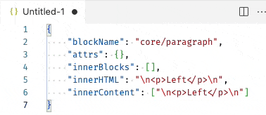
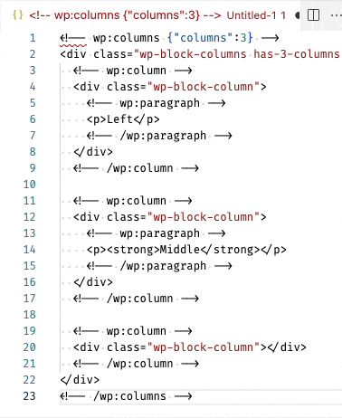

# Wordpress Gutenberg HTML Block parse/serialize JSON

Convert a selected text area with Wordpress Gutenberg HTML Blocks to/from JSON.
If the selected text is empty it will take the content of the clipboard an inserts at the current cursor position.

[](https://marketplace.visualstudio.com/items?itemName=heissenbergerlab.wp-blocks-to-json)   

## Features

- User selected text or clipboard content
- Convert from HTML Blocks to JSON
- Convert from JSON Block representation back to HTML Block

## Release Notes

see [Changelog](https://github.com/aheissenberger/wp-blocks-to-json-vscode/raw/master/CHANGELOG.md)

## Preview

**JSON to HTML blocks:**

<p align="center">
  
</p>


**HTML blocks to JSON:**

<p align="center">
  
</p>


### Command `WP Blocks HTML from JSON`

**from JSON:**

```json
{
  "blockName": "core/paragraph",
  "attrs": {},
  "innerBlocks": [],
  "innerHTML": "\n<p>Left</p>\n",
  "innerContent": ["\n<p>Left</p>\n"]
}
```

**to WP HTML Blocks:**

```html
<!-- wp:paragraph -->
<p>Left</p>
<!-- /wp:paragraph -->
```

### Command `WP Blocks HTML to JSON`

**from Javascript Object/Array:**

```html
<!-- wp:columns {"columns":3} -->
<div class="wp-block-columns has-3-columns">
  <!-- wp:column -->
  <div class="wp-block-column">
    <!-- wp:paragraph -->
    <p>Left</p>
    <!-- /wp:paragraph -->
  </div>
  <!-- /wp:column -->

  <!-- wp:column -->
  <div class="wp-block-column">
    <!-- wp:paragraph -->
    <p><strong>Middle</strong></p>
    <!-- /wp:paragraph -->
  </div>
  <!-- /wp:column -->

  <!-- wp:column -->
  <div class="wp-block-column"></div>
  <!-- /wp:column -->
</div>
<!-- /wp:columns -->
```

**to JSON block structure:**

```json
[
  {
    "blockName": "core/columns",
    "attrs": {
      "columns": 3
    },
    "innerBlocks": [
      {
        "blockName": "core/column",
        "attrs": {},
        "innerBlocks": [
          {
            "blockName": "core/paragraph",
            "attrs": {},
            "innerBlocks": [],
            "innerHTML": "\n<p>Left</p>\n",
            "innerContent": ["\n<p>Left</p>\n"]
          }
        ],
        "innerHTML": "\n<div class=\"wp-block-column\">\n        \n\n    </div>\n",
        "innerContent": [
          "\n<div class=\"wp-block-column\">\n        \n",
          null,
          "\n    </div>\n"
        ]
      },
      {
        "blockName": "core/column",
        "attrs": {},
        "innerBlocks": [
          {
            "blockName": "core/paragraph",
            "attrs": {},
            "innerBlocks": [],
            "innerHTML": "\n<p><strong>Middle</strong></p>\n",
            "innerContent": ["\n<p><strong>Middle</strong></p>\n"]
          }
        ],
        "innerHTML": "\n<div class=\"wp-block-column\">\n        \n\n    </div>\n",
        "innerContent": [
          "\n<div class=\"wp-block-column\">\n        \n",
          null,
          "\n    </div>\n"
        ]
      },
      {
        "blockName": "core/column",
        "attrs": {},
        "innerBlocks": [],
        "innerHTML": "\n<div class=\"wp-block-column\"></div>\n",
        "innerContent": ["\n<div class=\"wp-block-column\"></div>\n"]
      }
    ],
    "innerHTML": "\n<div class=\"wp-block-columns has-3-columns\">\n    \n\n    \n\n    \n\n</div>\n",
    "innerContent": [
      "\n<div class=\"wp-block-columns has-3-columns\">\n    \n",
      null,
      "\n    \n",
      null,
      "\n    \n",
      null,
      "\n</div>\n"
    ]
  }
]
```

## Requirements

None.

<!--
## Extension Settings

This extension contributes the following settings:

- `wp-blocks-to-json.phpexec`: Set to path of your `php` binary if the extention cannot find it based on the systems `PATH` settings. Error: `Invalid PHP Array Code: Error: spawn php ENOENT`


## Known Issues

Calling out known issues can help limit users opening duplicate issues against your extension.
-->

## Resources used

- Parsing [@wordpress/block-serialization-default-parser](https://github.com/WordPress/gutenberg/blob/f70ecc57761dbafa4df6b4953be78d59a7841d57/packages/block-serialization-spec-parser/README.md)
- Serialize [@wordpress/blocks](https://github.com/WordPress/gutenberg) - manuel extraction of relevant code parts as the full library would need a browser environment

## Out of Scope requirements

This is a list of features which are not planed to implement:

- Formating the converted result - not needed as there are allready builtin tools which can do this and in most cases the minified version is needed.
- JSON to PHP Array - use [PHP Array from/to JSON or JavaScript](https://marketplace.visualstudio.com/items?itemName=heissenbergerlab.php-array-from-json) VS Code Extension

## Licence

[BSD 2 Clause](https://github.com/aheissenberger/wp-blocks-to-json-vscode/raw/master/LICENSE.txt)
